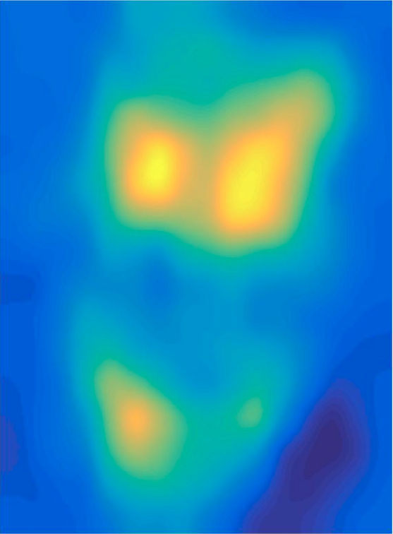
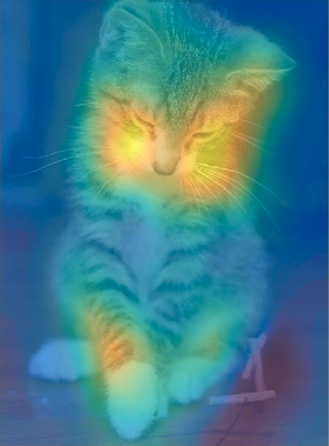
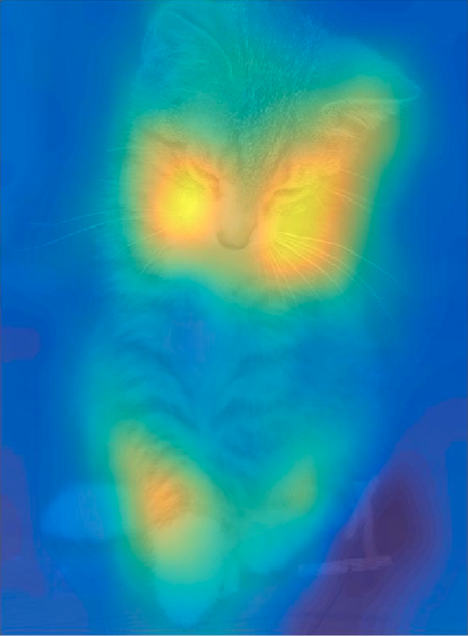

# heatmap-matlab
MATLAB code to generate heatmap.

 |  | 
:---:|:---:|:---:
Original image | Heatmap | image + heatmap

Visual results for different values of transparency

 |  | 
:---:|:---:|:---:
alpha=0.45 | alpha=0.65 | alpha=0.85
